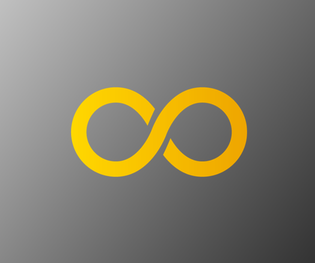

<h1>Hi, I'm Lunesombre, aka Romain.</h1>

<h2>I'm an apprentice developper</h2>

After some self-training, I integrated a one-year training course to validate a web developper diploma with Human Booster .

 I'm also planning to do a 1 year work-study program starting in September 2023 with  to learn  , , ... And gain experience within a company ! 
If you're interested in a work-study student, please contact me at <a href="romain.touchet+github@gmail.com"

<h3>Techs I'm already used with :</h3>

- ,  and 

- 

-  and 

- 

- design, manage & admin databases -  and 

- working in  containers.
    
- working with  and .

<h3>I'm currently learning  .

<h3>Soon I'll be :</h3>

     
- learning to work with .
     
- and also 
     

<h4>I'm planning my work on </h4>
     
- 
     
<h4>I have also a litte experience on </h4>

     
- 

- 
     

<h2>Apart from web development, I'm interested in</h2>

- Aeronautics and space industries.

        I'm a space exploration and astronomy enthusiast. 
        I can spend hours watching the sky with binoculars or my Newton 300 telescope.

- Energy industries, especially clean ones as (scientific) ecology is a matter of utmost importance for me.

        Wind turbine, hydroelectric, nuke, carbon-capture and cogeneration...

- I cook. A. LOT. 

        That's how I got my wife ;)

- Gardening

        I grow food (leeks, potatoes and sweet potatoes, onions...), trees (Olive trees, Alizia julibrissini...), flowers...
        My terrace (pretty large) is looking like a jungle. :)

You can reach me on  or via email at <a href="mailto:romain.touchet+github@gmail.com">romain.touchet@gmail.com</a>.

